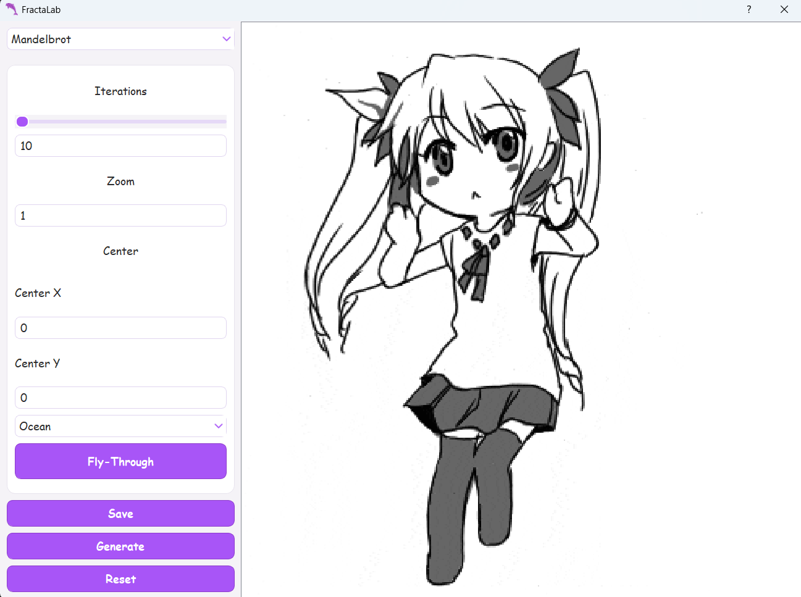
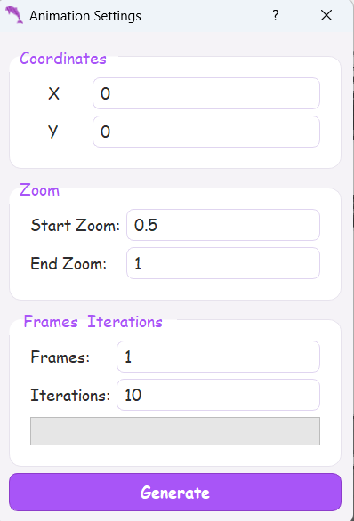
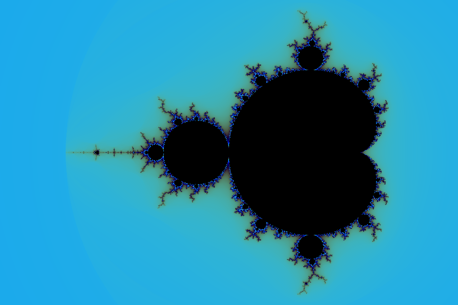
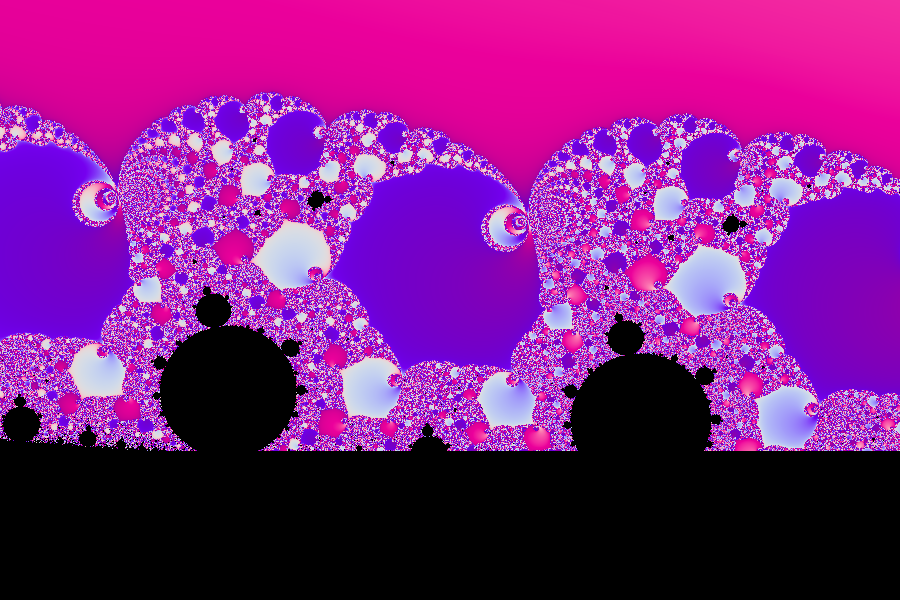
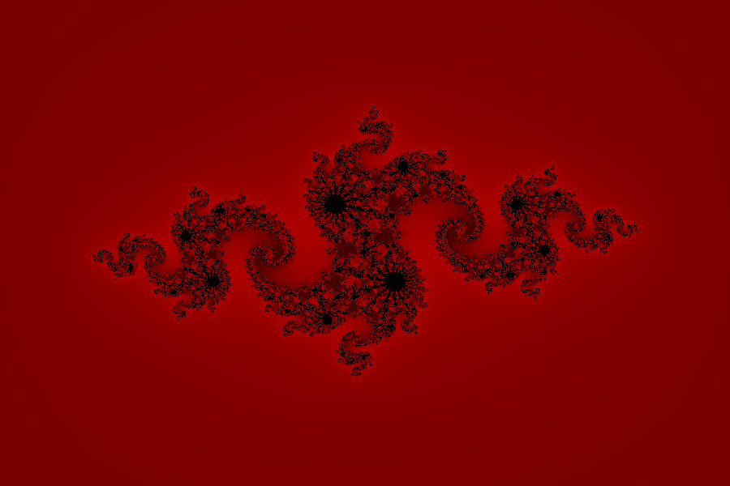
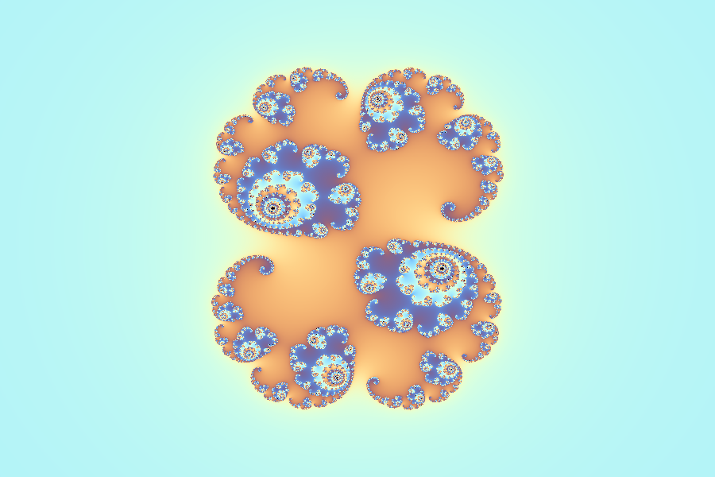

# FractaLab

Десктоп-застосунок для генерації та візуалізації фракталів. Інтерфейс зібраний у Qt Designer (`ui/main.ui`, `ui/zoom.ui`) і підвантажується через `loadUi`.

## Можливості
- Множина Мандельброта і множина Жюліа: керування ітераціями, зумом та центром, параметром `c`, кольорові теми (Ocean, Fire, Ice, Neon, Pastel) і користувацька палітра через діалог вибору кольору.
- L-системи: введення аксіоми та до трьох правил, авто-визначення рисувальних символів, авто-масштабування, пресети (Fractal Tree, Dragon Curve, Sierpinski Triangle, Koch Snowflake, Fractal Plant, Crystal, Spiral, Hilbert Curve, Square Fractal), побудова анімації з збереженням у GIF.
- Крива/сніжинка Коха: вибір типу (лінія або сніжинка), рівень рекурсії, товщина лінії.
- Експорт: PNG/JPEG для всіх фракталів; GIF-анімація для L-system; MP4-відео плавного зуму для Мандельброта/Жюліа.
- Додатково: скидання палітри до Ocean, попередження при великих ітераціях, плавна поява вікна.

## Скріншоти




## Встановлення
```
python -m venv .venv
.venv\Scripts\activate
pip install -r requirements.txt
```
Список залежностей: PyQt5, NumPy, OpenCV (`opencv-python`), Pillow (для збереження GIF). Працює на Python 3.10+.

## Запуск
```
python main.py
```
Або запустіть готовий `FractaLab.exe` (Windows).

## Керування
- Вибір фрактала: випадаючий список перемикає між Мандельбротом, Жюліа, L-system і Кохом.
- Кольорові теми: списки для обох комплексних фракталів; варіант `Custom` відкриває діалог вибору кольору; `Reset Palette` повертає тему Ocean.
- Мандельброт: ітерації, масштаб `Zoom`, центр (`Center X/Y`). `Generate` будує зображення.
- Жюліа: параметри `c` (`C Real`/`C Imag`), центр і масштаб, ітерації; кнопки такі самі, як у Мандельброта.
- L-system: вкажіть `Axiom`, правила (до трьох рядків у форматі `F -> FF+F--F+F`), кут, довжину кроку, кількість ітерацій; є випадаючий список з пресетами. Генератор автоматично масштабує рисунок, а при збереженні GIF беруться кадри останньої генерації.
- Кох: оберіть `Line` або `Snowflake`, рівні рекурсії та товщину, потім `Generate`.
- Збереження: `Save` пропонує PNG/JPEG, а для L-system — GIF. Для GIF використовуються кадри з останньої генерації L-system.
- Відео-зум: кнопка `Zoom video` відкриває діалог (`ui/zoom.ui`), де задаються початкові/кінцеві координати й масштаб, кількість кадрів та ітерацій; результат зберігається в MP4 (OpenCV).

## Структура
- `main.py` — точка входу, підключає UI, стилі, обробники та генератори.
- `fractals/` — генератори: `mandelbrot.py`, `julia.py`, `Lsystem.py`, `koha.py`, пресети `lsystem_presets.py`.
- `utils/` — допоміжні класи (діалог зуму, потік генерації відео, експорт MP4, форматування спінбоксів).
- `ui/` — файли інтерфейсу з Qt Designer.
- `resources/` — іконки, gif-заглушки, стилі QSS; `resources_rc.py` — скомпільований ресурсний модуль.

## Приклади згенерованих фракталів в застосунку






